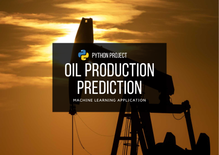
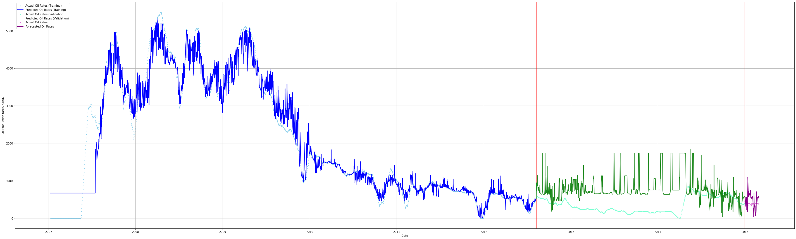
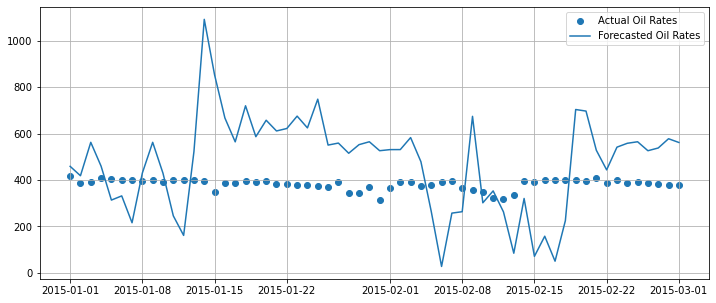

# Oil Production Prediction

<!---Esses são exemplos. Veja https://shields.io para outras pessoas ou para personalizar este conjunto de escudos. Você pode querer incluir dependências, status do projeto e informações de licença aqui--->

### :speech_balloon: Intro

From production data is possible to predict future oil production based on past trends. Machine learning tools such as the SckitLearn library allow you to make these predictions using methods such as Linear Regression and RandomForest. Depending on the dataset, one method may be more efficient than the other. In this project we used both methods, using the MSE to measure the accuracy of the results.

### :rocket: Objectives

> - Apply machine learning methods to forecast production.
> - Measure the accuracy of the results obtained in the forecast using the MSE.
> - Development of a model in RandomForest to predict the next month's oil production.

## :chart_with_upwards_trend: Results

> - Forecast charts track real production most of the time.
> - It was possible to define a forecast for the next month.

<!--## :bar_chart: Images-->
<table>
  <tr>
    <td align="center">
      <a href="image-1.png">
         
        
          <b>Real x Predicted 1</b>
        
      </a>
    </td>
    <td align="center">
      <a href="image-2.png">
         
        
          <b>Real x Predicted 2</b>
        
      </a>
    </td>
</table>
